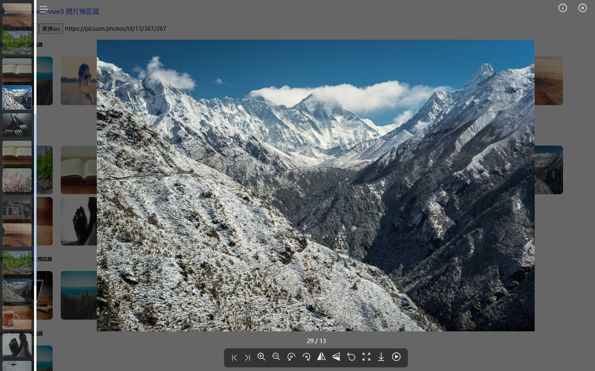
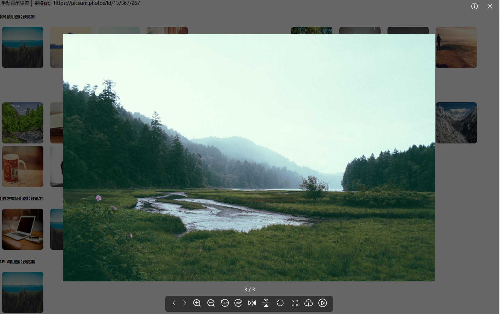

[](https://npmjs.org/package/images-viewer-vue3)
[](https://www.npmjs.com/package/images-viewer-vue3)
[](https://npmjs.org/package/images-viewer-vue3)

# images-viewer-vue3
A lightweight image viewer for Vue3, it is based on `flip animation` technology, Support PC and h5 mobile web page preview photos, if it is a product developed by vue3.

[images-viewer-vue3 demo](https://github.com/qiunanya/vue3-major-editor/tree/main/packages/image-viewer)(https://github.com/qiunanya/vue3-major-editor/tree/main/packages/image-viewer)

[Case screenshot: https://blog.csdn.net/qq_41444226/article/details/144258656](https://blog.csdn.net/qq_41444226/article/details/144258656)

# Features
* Component preview image
* Command preview image
* API preview image

# Function
* Rotate image
* Zoom image
* Flip image
* Drag image
* Download image
* AutoPlay image
* Full screen preview image
* Image information

# Install 

```js
npm install images-viewer-vue3
--or
pnpm add images-viewer-vue3
--or
yarn add images-viewer-vue3
```
# Config
```js
// main.ts
import { createApp } from "vue";
import App from "./App.vue";
import ImagesViewerVue3 from 'images-viewer-vue3';

const app = createApp(App)
// Image preview directive will be automatically injected here.
// Includes preview directive and lazy loading directive
app.use(ImagesViewerVue3, {
    zIndex: 999, // Default 999
    language: 'zh-cn', // Default language 'zh'
    scaleRatio: 1, // Default 1
    rotateRatio: 90, // Default 90 degrees
    isEnableDrag: true, // Enabled by default
    isEnableWheel: true, // Enabled by default
    playSpeed: 2000, // playSpeed Default 2000 ms
    isDownLoad: true, // Enabled by default
    isHiddenSiderNav: false // Enabled by default
    isHiddenSearch: false, // Disable by default
})
app.mount("#app")
```

## Config

Initialize the configuration in `app.use(ImagesViewerVue3,options)` of the `main.ts` file.

| Option | Allowed Value | Default  | Description |
| ------------- |-------------| -----| -------- |
| scaleRatio | number in percentage | 1 | It defines the initial zoom value of the image. |
| zIndex | number in percentage | 999 | Initial value of the previewer stacking order property. |
| rotateRatio | number in percentage | 90 | It defines the initial value of the image rotation angle. |
| isEnableDrag | boolean | true | Defines whether to enable the drag and drop function. |
| isEnableWheel | boolean | true | Defines whether to enable mouse scrolling to zoom the image. |
| language | 'zh-cn' or 'en-us' | 'zh-cn' | Define the prompt text display language.|
| playSpeed | number | 2000 | play speed, Default 2000 ms.|
| isDownLoad | boolean | true | Download enabled by default |
| isHiddenSiderNav | boolean | false | isHiddenSiderNav enabled by default |
| isHiddenSearch | boolean | false | Disable by default |
# Usage

## Component preview image
The component wraps the image element, click directly to preview.
```js
<ImagesViewerVue3>
    
    
    
</ImagesViewerVue3>
```



## Command preview image
Add v-image-viewer to the image tag that needs to be previewed. All imgs with added instructions will be automatically added to the preview list.
```js


```
### Support lazy loading instructions
```js


<script setup lang="ts">
import { ref } from 'vue'
const currentSrc = ref('https://picsum.photos/id/13/367/267')
</script>
```


## API preview image
```js


<script setup lang="ts">
import { imageViewerApi, onUpdate } from 'images-viewer-vue3'

// Monitor current picture information
onUpdate((image:string, index: number) => {
    console.log(image, index)
})

const previewImage = (evt) => {
    if (!evt.target) return
    const iDom = evt.target as HTMLImageElement
    imageViewerApi({
        // Custom Navigation Image Highlighting Index
        specifyIndex: 0,
        // Current image src
        current: iDom.src,
        // Enable flip animation
        imageDom: iDom,
        // Preview more pictures
        // images: ['src','src1', 'src2', ...],
    })
}
</script>
```

# Keyboard-shortcuts-windows
The `images-viewer-vue3` has built-in commonly used shortcut keys.

| Shortcut Key | Function Description |
| ------------- |-------------|
| Right(→) | Next |
| Left(←) | Previous |
| Ctrl+I+Y | Flip Vertically |
| Ctrl+I+X | Flip Horizontal |
| Ctrl+C+R | Rotate 90 degrees clockwise |
| Ctrl+C+L | Rotate 90 degrees counterclockwise |
| Ctrl+Z | Restore initial value |
| Ctrl+'+' | Zoom |
| Ctrl+'-' | Zoom out |
| Space | AutoPlay and StopPlay |
| ESC | Close Preview |